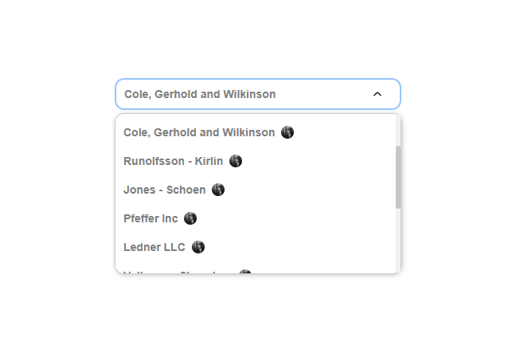

for run project: 
npm install 
‌npm start 

---
React Dropdown Component Documentation 
Overview 
This project is a React application that includes a modular dropdown component designed for easy integration and customization. The dropdown component is built using functional components and follows best practices for React development. 
Project Structure 
The project is organized into two main folders: components , modules and utils. 
Components 
The components folder contains all the UI components of the application. Within this folder, there is a module subfolder that specifically houses the dropdown component. 
Module Folder 
DropDown.js: This file defines the functional component for the dropdown. It handles the rendering of the dropdown menu, manages the selection of options, and maintains the internal state of the dropdown. 
DropDown.types.js: This file contains TypeScript type definitions for the dropdown component. It specifies the expected props, ensuring type safety and better developer experience. 
DropDown.scss: This file includes the styles for the dropdown component. It defines the visual appearance, including colors, spacing, and hover effects. 
Utils 
The utils folder is dedicated to utility functions that can be reused throughout the application. These functions may include data manipulation, formatting, and other helper methods that support the main components. 
Usage 
To use the dropdown component in your application, import it as follows: 
You can then include it in your JSX and pass the necessary props as defined in types.ts. 
Conclusion 
This documentation provides an overview of the dropdown component and its structure within the React application. For further customization and usage details, please refer to the individual component files and their respective comments. 
---
Feel free to modify any sections to better fit your project's specifics! 

